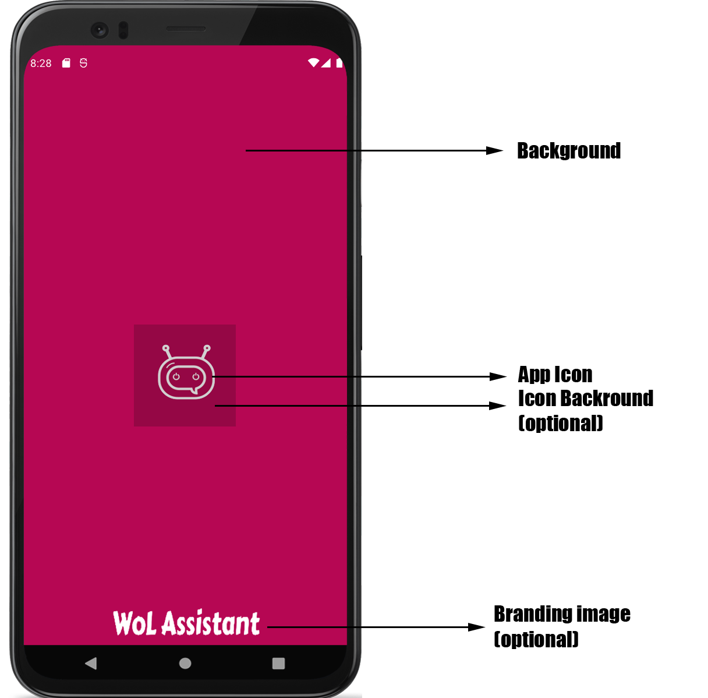
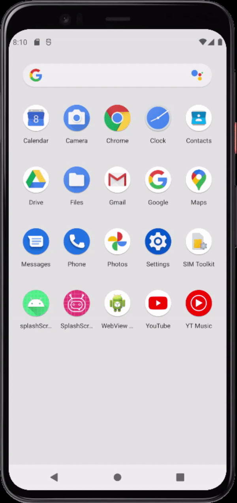

En la Google I/O de 2021 una de las nuevas características del ecosistema Android que pasó un poco desapercibida ha sido la llegada de una nueva API que permite la creación rápida de las denominadas Splash Screen. Un Splash Screen consiste en una pantalla inicial que muestra el logotipo de la aplicación durante uno o varios segundos y que puede o no realizar ciertas operaciones, como por ejemplo, la carga de datos durante ese tiempo para posteriormente realizar una transición hacia la aplicación en sí.

Esta nueva API, disponible a partir de la beta de Android 12, permite crear una Splash Screen de manera sencilla.

## Funcionamiento de una splash screen

La splash screen es una pantalla que sólo aparece al abrir una aplicación cuando el proceso asociado a dicha aplicación no está ejecutándose o la activity asociada a dicha splash screen no ha sido creada anteriormente.

En este momento, se lanza la splash screen utilizando el tema y las animaciones definidas para posteriormente realizar una transición a la propia aplicación.

Los elementos de una splash screen son los siguientes:



## Creando nuestra splash screen

Por defecto, las aplicaciones desarrolladas para Android 12 incorporan una Splash screen pero la misma puede ser customizada utilizando los diferentes elementos mostrados en la imagen anterior. Para ello simplemente debemos configurar diferentes opciones en nuestro fichero de temas `themes.xml` .

- Para definir el color de nuestro **background** podemos añadir lo siguiente en nuestro fichero `themes.xml`.

```xml
<item name="android:windowSplashScreenBackground">@color/colorPrimaryDark</item>
```

- Para definir el **icono** que vamos a utilizar podemos añadir lo siguiente en nuestro fichero `themes.xml`.

```xml
<item name="android:windowSplashScreenAnimatedIcon">@drawable/ic_launcher_hq_foreground</item>
```

- Para definir la imagen de **branding** podemos añadir lo siguiente en nuestro fichero `themes.xml`.

```xml
<item name="android:windowSplashScreenBrandingImage">@drawable/wol</item>
```

- Finalmente, para añadir el fondo de nuestro icono podemos añadir lo siguiente en nuestro fichero `themes.xml`.

```xml
<item name="android:windowSplashScreenIconBackground">@color/colorAccent</item>
```

Las imágenes que podemos ver a continuación nos muestran las dos posibilidades de splash screen posibles con y sin imagen de branding.


## Controlando el tiempo de vida de nuestro splash screen

Por defecto, el tiempo en pantalla durante el que nuestra splash screen es visible es de 1000 ms. Podemos customizar este comportamiento en nuestra activity utilizando el código que se muestra a continuación:

```java
val content: View = findViewById(android.R.id.content)
        content.viewTreeObserver.addOnPreDrawListener(
            object : OnPreDrawListener {
                override fun onPreDraw(): Boolean {
                    // Check if the initial data is ready.
                    return if (isReady) {
                        // The content is ready; start drawing.
                        content.viewTreeObserver.removeOnPreDrawListener(this)
                        true
                    } else {
                        // The content is not ready; suspend.
                        false
                    }
                }
            }
        )
```

## Bonus: Añadir una animación al icono de nuestra aplicación

En cuanto a animaciones y/o transiciones del splash screen podemos aplicar animaciones al icono de nuestra aplicación y también podemos editar la transición desde la splash screen hacia la activity. A continuación, se muestra el código de ejemplo de dicha animación:

```java
splashScreen.setOnExitAnimationListener { view ->
    view.iconView?.let { icon ->
        // set an animator that goes from height to 0, it will use AnticipateInterpolator set at the bottom of this code
        val animator = ValueAnimator
            .ofInt(icon.height, 0)
            .setDuration(2000)
        //update the icon height and width every time the animator value change
        animator.addUpdateListener {
            val value = it.animatedValue as Int
            icon.layoutParams.width = value
            icon.layoutParams.height = value
            icon.requestLayout()
            if (value == 0) {
                view.remove()
            }
        }
        val animationSet = AnimatorSet()
        animationSet.interpolator = AnticipateInterpolator()
        // Default tension of AnticipateInterpolator is 2,
        // this means that the animation will increase first the size of the icon a little bit and then decrease
        animationSet.play(animator)
        animationSet.start() // Launch the animation
    }
}
```

Para finalizar podemos ver también el resultado final de nuestra aplicación tras aplicar la animación a nuestro icono.



## Referencias

[Sample project Github repository](https://github.com/IvanSantosGonz/Android12SplashScreenAPI)

[https://developer.android.com/about/versions/12/features/splash-screen](https://developer.android.com/about/versions/12/features/splash-screen)

[https://developer.android.com/training/animation/overview](https://developer.android.com/training/animation/overview)