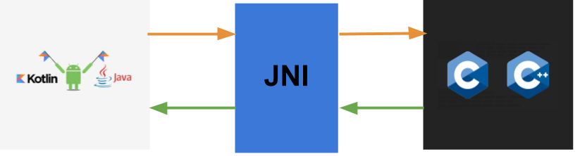
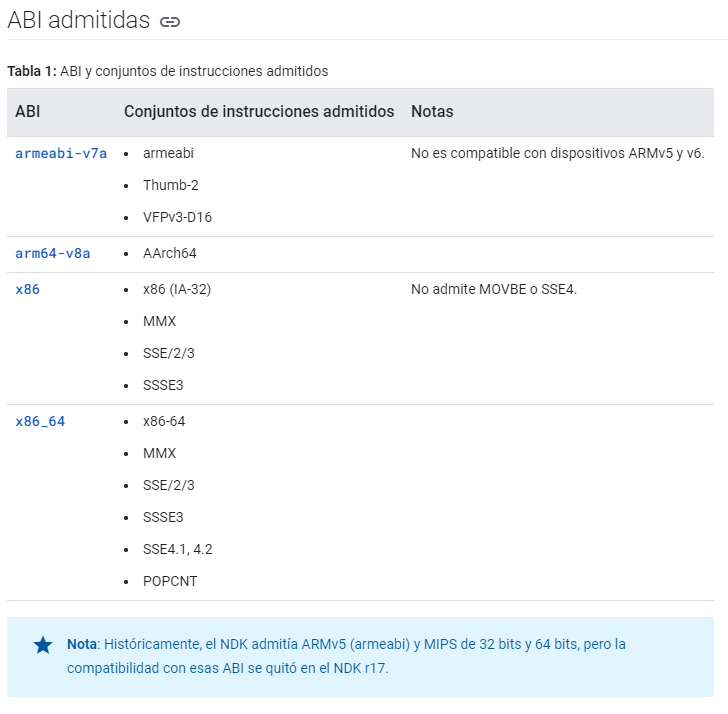
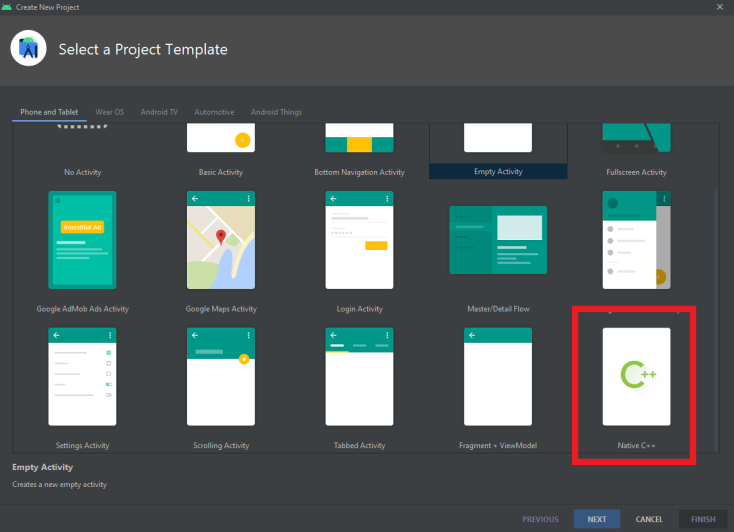
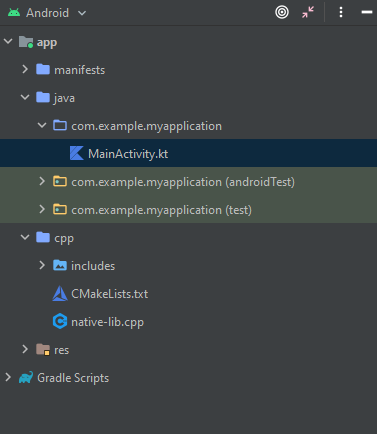
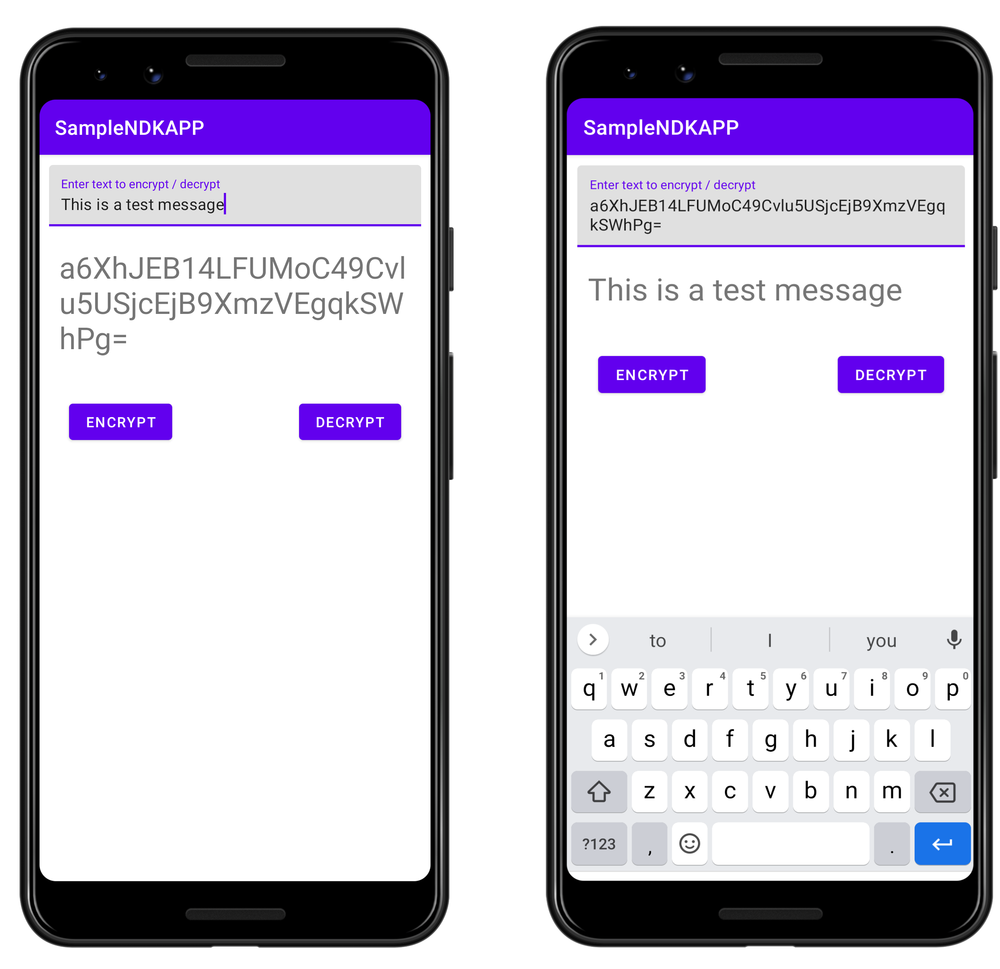
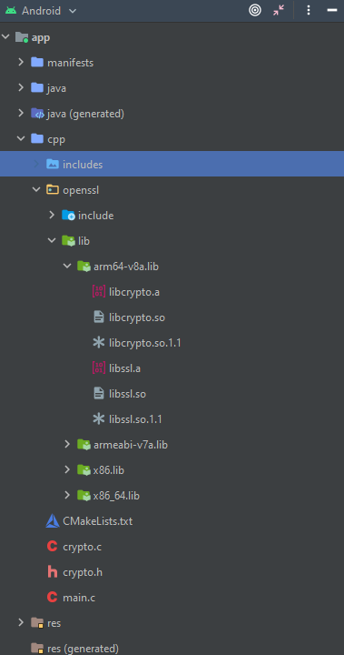
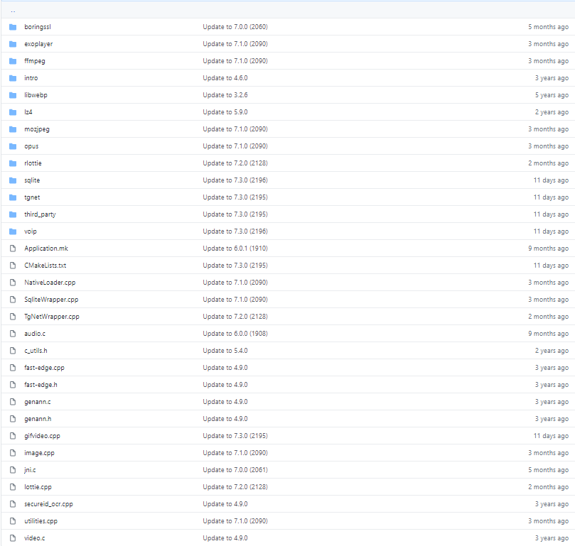

# Android NDK: Descubriendo por qué la app Android de Instagram está escrita en C/C++

¿Qué cara 🤪 pondrías si te dijera que algunas de las aplicaciones móviles que más utilizas en el día a día tienen parte
de su código escrito en C o C++? Tal vez pensarías que es la típica pregunta con trampa y que tal vez utilizan alguna
librería del sistema que está escrita en dichos lenguajes de programación. Pero este no es el caso de aplicaciones como
Whatsapp, Skype, Instagram o Facebook donde parte del código de sus aplicaciones está escrito en estos lenguajes
utilizando posteriormente el conjunto de herramientas del NDK de Android para hacer llamadas a las mismas. Muestra de
esto es, por ejemplo, la siguiente oferta de trabajo publicada por Facebook donde buscan un/una Ingenier@ expert@ en el
NDK de Android.


## ¿Qué es y cómo funciona el NDK de Android? 📱

El NDK de Android (Native Development Kit) permite que l@s desarrollador@s podamos reutilizar código desarrollado en
C/C++ pudiendo ejecutarlo en nuestras aplicaciones a través del uso de JNI (Java Native Interface). JNI es conjunto de
herramientas que nos permite que cualquier programa escrito en Java, y por tanto, que funciona en la máquina virtual de
Java, pueda ejecutar código escrito en otros lenguajes como C, C++ o incluso ensamblador.

El NDK de Android nos permite a su vez manejar como se compilan nuestro código nativo utilizando NDK-build o CMake. El
funcionamiento general del NDK en nuestra aplicación Android sigue el flujo siguiente:



Tenemos nuestro código Android donde en primer lugar debemos cargar la librería nativa que vamos a utilizar y la
cabecera de los métodos nativos de la misma que utilizaremos. Mientras que por otro lado en nuestro código C/C++ debemos
tener la implementación de esas funciones definidas en Java/Kotlin. Posteriormente, entraremos más en detalle en estos
aspectos con nuestro ejemplo práctico.

Por otro lado, hay que tener en cuenta que nuestro código nativo no va a ejecutarse en una máquina virtual de Java y
que, por tanto, debe estar compilado para que pueda ser ejecutado en las diferentes arquitecturas de procesadores
disponibles en Android si queremos que desde cualquier dispositivo se pueda ejecutar nuestra App. Además, las librerías
que utilicemos, deben también compilarse para ser ejecutadas en las diferentes arquitecturas que soporte nuestra app. La
combinación entre la arquitecturas de CPU y los conjuntos de instrucciones que las mismas pueden ejecutar componen cada
una de las plataformas para las que debemos compilar nuestra aplicación. A día de hoy, estas son las combinaciones,
llamadas ABI (interfaz binaria de aplicación), disponibles en Android:



Finalmente, hay que tener en cuenta que el uso del NDK puede ser útil en cierto tipo de aplicaciones, mientras que en
otras no sería necesario utilizarlo debido al aumento de la complejidad del proyecto sin obtener grandes beneficios por
ello.

## ¿Cuándo debería utilizar el NDK de Android?🤔

Desde mi punto de vista, hay dos situaciones principales donde me decantaría por utilizar código nativo en mi aplicación
Android.

Sin lugar a dudas el primer factor que me haría decantarme a utilizar el NDK de Android no es otro que la mejora de
rendimiento de mi aplicación. En mi caso concreto, lo he utilizado comúnmente para ejecutar funciones criptográficas en
mis aplicaciones, donde el uso de ciertas librerías para trabajar con funciones matemáticas escritas en C proporciona
mayor rendimiento y facilidad para ejecutar las mismas. En este tipo de aplicaciones, el cifrado/descifrado de grandes
cantidades de datos podría hacer inusable nuestra aplicación, por lo que el uso del NDK proporciona ese rendimiento
extra necesario debido a que dichas operaciones son ejecutadas directamente en la CPU sin pasar por la JVM. Otro tipo de
aplicaciones donde el rendimiento es especialmente importante, son las relacionadas con la codificación de datos
multimedia como audio y video o los videojuegos donde el uso del NDK está totalmente recomendado.

El segundo factor que me haría decantarme por el uso del NDK de Android sería el disponer de una amplia base de código
escrita en este lenguaje, lo suficientemente estable, testeada y probada de manera que requiera de pocos cambios durante
su vida útil o cuyo equipo de desarrollo pueda mantener la misma.

## Ejemplo de aplicación utilizando el NDK de Android 👀

El primer paso consiste en crearnos un nuevo proyecto en Android Studio basado en el NDK.



Una vez que hayamos creado nuestro proyecto, dispondremos de nuestra aplicación Hello World utilizando el NDK. Podemos
observar como en la estructura de nuestro proyecto tenemos un directorio `Java`y otro directorio `cpp` donde tendremos
el código Java y el código nativo respectivamente.



En el ejemplo que vamos a ver a continuación vamos a desarrollar una aplicación que cifra y descifra mensajes de texto.

Aquí podemos ver una captura de la interfaz de usuario de la aplicación:



Como podemos ver disponemos de dos botones `cifrar`y `descifrar`, que son los encargados de invocar a nuestras funciones
responsables de dicho cometido. Dichas funciones, internamente harán uso de la librerías propias de `openssl` escritas
en C para hacer ejecutar diferentes funciones y algoritmos criptográficos. Un aspecto importante a la hora de utilizar
el NDK de Android es que tendremos que realizar una envoltura a las diferentes funciones que utilicemos de nuestro
código C y que queramos invocar desde nuestro código Java/Kotlin. Es se debe a que dichas funciones deben utilizar el
JNI para recibir como entrada los tipos de datos necesarios, convertirlos a tipos de datos válidos en C y hacer la
operación inversa en el momento de devolver algún resultado, convertir los tipos de datos de C a tipos de datos válidos
en Java.

El primer paso para configurar nuestra aplicación consiste en importar nuestra librería así como la librería `openssl` a
nuestro proyecto. Para ello además de tener los ficheros necesarios en nuestro proyecto, debemos enlazarlos dentro del
fichero `CMakeLists.txt`.



Como podemos observar en la imagen, dentro del directorio `cpp` tenemos la librería `openssl` previamente compilada para
cada una de las ABIs que vamos a soportar en el proyecto (que podrían o no ser todas las disponibles, o solo un
subconjunto de las mismas) así como el directorio `include` donde tenemos los ficheros de cabecera con las diferentes
funciones de la librería `openssl` que vamos a utilizar.

Por otro lado, tenemos nuestra librería, `crypto.c` y su correspondiente fichero de cabeceras `crypto.h` y el
fichero `main.c` punto de entrada a nuestro código nativo.

A continuación, podemos observar el fichero `CMakeLists.txt` con cada una de las opciones comentadas para entenderlas
mejor.

```makefile
# versión mínima de CMake necesaria para compilar la librería
cmake_minimum_required(VERSION 3.10.2)

# declaración y nombre del proyecto
project("samplendkapp")

#inclusión de los ficheros de cabecera de las librerías a utilizar (openssl)
include_directories(${CMAKE_CURRENT_SOURCE_DIR}/openssl/include) 

# Añadimos nuevas librerías, libcrypto y libssl que son los dos componentes de openssl
add_library(libcrypto STATIC IMPORTED) 
add_library(libssl STATIC IMPORTED)

# Linkamos las librerias con los ejecutables previamente compilados utilizando la variable ${ANDROID_ABI} para diferenciar por tipo de ABI
set_target_properties(libcrypto PROPERTIES IMPORTED_LOCATION ${CMAKE_CURRENT_SOURCE_DIR}/openssl/lib/${ANDROID_ABI}/lib/libcrypto.a)
set_target_properties(libssl PROPERTIES IMPORTED_LOCATION ${CMAKE_CURRENT_SOURCE_DIR}/openssl/lib/${ANDROID_ABI}/lib/libssl.a)

add_library( # seteamos el nombre de la nueva librería que vamos a crear para se consumidad de Java/Kotlin.
             native-lib
             # La seteamos como compartida.
             SHARED
             # Seteamos la ruta relativa a los ficheros fuente de nuestra librería
             crypto.c
             main.c )

# Busca una biblioteca predefinida especificada y almacena la ruta como variable. 
# Debido a que CMake incluye bibliotecas del sistema en la ruta de búsqueda
# predeterminada, solo necesita especificar el nombre de la biblioteca pública del NDK
# que se desea agregar. CMake verifica que la biblioteca exista antes para
# completar su construcción.

find_library( # nombre de la librería que utilizaremos.
              log-lib

              # nombre de la librería del sistema que CMake debe localizar
              log )

# Especifica las bibliotecas que CMake debe vincular a su librería de destino.
# Se pueden vincular varias librería , como las librería definidas en este
# script, bibliotecas de terceros precompiladas o bibliotecas del sistema.

target_link_libraries( # librería de destino.
                       native-lib

                       # Librerías que vamos a linkar a native-lib
                        libcrypto
                        libssl
                       ${log-lib} )
```

El siguiente paso consiste en cargar nuestra librería nativa en nuestro código, para ello bastaría con un companion
object en la activity desde la cual lo vamos a llamar y crear las cabeceras de las funciones de nuestro código C que
llamaremos desde aquí. La palabra reservada `external` hace referencia a que la función a la que vamos a llamar está
escrita en un lenguaje diferente de Java/kotlin y en Java se declara con la palabra reservada `native`.

```kotlin
private external fun encryptFromJNI(message: String): ByteArray
private external fun decryptFromJNI(message: ByteArray): String

companion object {
        init {
            System.loadLibrary("native-lib")
        }
    }
```

Finalmente, creamos en C nuestras funciones que envuelve a los métodos que vamos a llamar de nuestra librería en código
nativo ([crypto.c](https://github.com/IvanSantosGonz/CryptAndDecriptAndroidNDK/blob/master/app/src/main/cpp/crypto.c)),
y que recibe y devuelve objetos con tipado del JNI, que son fácilmente identificables debido a que todos los tipos
empiezan por J, `jstring , jint, jchar, etc`. Otro aspecto a tener en cuenta, es que para que este método haga
referencia a la cabecera que declaramos desde Java/Kotlin, el nombre del mismo debe coincidir con la ruta completa del
fichero donde la cabecera es invocada, separando cada subdirectorio con guion bajo.

Finalmente, podemos observar también como se usa la palabra reservada `JNIEXPORT` seguida del tipo de dato que queremos
devolver, así como seguido de la palabra reservada `JNICALL` como anotación a cada método.

El código completo de este ejemplo está disponible en el siguiente repositorio de Github:

[https://github.com/IvanSantosGonz/CryptAndDecriptAndroidNDK](https://github.com/IvanSantosGonz/CryptAndDecriptAndroidNDK)

```C
JNIEXPORT jbyteArray JNICALL
Java_com_samplendkapp_MainActivity_encryptFromJNI(JNIEnv *env, jobject this, jstring message) {

    int ciphertext_len;
    unsigned char ciphertext[128];

    unsigned char *plaintext = (*env)->GetStringUTFChars(env, message, 0);

    ciphertext_len = encrypt(plaintext, strlen((char *) plaintext), key, iv,
                             ciphertext);
    BIO_dump_fp(stdout, (const char *) ciphertext, ciphertext_len);

    jbyteArray array = (*env)->NewByteArray(env, ciphertext_len);
    (*env)->SetByteArrayRegion(env, array, 0, ciphertext_len, (jbyte *) (ciphertext));
    return array;
}

JNIEXPORT jstring JNICALL
Java_com_samplendkapp_MainActivity_decryptFromJNI(JNIEnv *env, jobject this, jbyteArray message) {

    int decryptedtext_len;

    unsigned char decryptedtext[128];

    int len = (*env)->GetArrayLength (env, message);
    unsigned char encryptedText[len];
    (*env)->GetByteArrayRegion (env, message, 0, len, (jbyte*) (encryptedText));

    decryptedtext_len = decrypt(encryptedText, len, key, iv,
                                decryptedtext);

    decryptedtext[decryptedtext_len] = '\0';

    return (*env)->NewStringUTF(env, decryptedtext);
}
```

## Huevo de Pascua 🥚🐰

Para no quedarnos con el click bait del título, hay que tener en cuenta que ciertas aplicaciones como son el caso de
Instagram, tienen versiones diferentes de su aplicación en otras plataformas como Android, IOS o Web. En el caso
concreto de Instagram, se utilizan diferentes librerías escritas en C para la codificación de video, así como los
filtros de imágenes y otras partes de su aplicación son creados utilizando código nativo C/C++ por dos razones
principales, tener la máxima eficiencia al aplicar los mismos, y a su vez poder reutilizar el código en todas las
plataformas necesarias. En el caso de Instagram, al ser una aplicación privada no podemos tener la certeza de esto, pero
sí que sabemos que es una práctica más común de lo que parece. Para ejemplo de ello, el código de una app que si podemos
observar es el de Telegram al ser de dominio
público, ([repositorio de Telegram](https://github.com/TelegramOrg/Telegram-Android/tree/master/TMessagesProj/jni))
donde podemos observar la gran cantidad de librerías basadas en código nativo que utiliza.



## Referencias 📚

- Repositorio del
  ejemplo: [https://github.com/IvanSantosGonz/CryptAndDecriptAndroidNDK](https://github.com/IvanSantosGonz/CryptAndDecriptAndroidNDK)
- Android developers NDK: [https://developer.android.com/ndk](https://developer.android.com/ndk)
- Android developers
  JNI: [https://developer.android.com/training/articles/perf-jni?hl=es-419](https://developer.android.com/training/articles/perf-jni?hl=es-419)