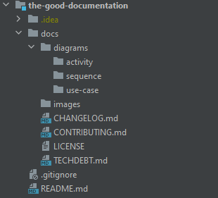

¿Cuántas veces has llegado a un nuevo proyecto y te ha surgido la pregunta de por dónde empezar o cómo echarlo a andar 🤷? La documentación debe ser una parte fundamental de cualquier proyecto, ya sea software libre o privativo, sea un proyecto personal o empresarial. En mi caso, tiendo a pensar cuando hago cualquier proyecto personal en mi yo del futuro y en cuanto tiempo y dolores de cabeza podré ahorrarle simplemente dándole un poco de cariño a la documentación.

Este artículo trata sobre que partes son, desde mi punto de vista, indispensables en la documentación de cualquier proyecto.

Para mí, la documentación debe estar escrita en inglés en la mayoría de proyectos, ya que es el idioma más común a la hora de programar. Aunque si el equipo se siente más cómodo trabajando en español o cualquier otro idioma también puede ser escrita en el mismo.

Otro punto importante en cuando a la documentación de un proyecto es el como organizamos la misma. A mí me gusta encontrarme la documentación relacionada con un proyecto, al menos la indispensable, en el propio repositorio del proyecto. Muchas veces cuando tendemos a externalizar la documentación utilizando herramientas varias como Notion, Confluence, Google Drive, etc. la misma puede correr el riesgo de estar desperdigada en varios lugares. Para mi la fuente única de verdad en cuanto a documentación debe ser el propio repositorio.

Además, algo que habla muy bien de los desarrolladores de un proyecto es que su documentación se mantenga actualizada frente a los cambios que surjan en el mismo. A veces, subestimamos las tareas que tienen que ver con la actualización de la documentación, pero mantenerla actualizada nos va a ahorrar muchos dolores de cabeza en el futuro 🤯.

En cuanto al formato de la misma, algo muy común es utilizar el formato Markdown, siendo el archivo `README.md` el punto de entrada a la misma. A título personal, me gusta que este sea el único fichero de documentación que se encuentre en la raíz del repositorio y suelo almacenar el resto de documentación dentro de un directorio `docs`, siguiendo la estructura que se muestra en la siguiente imagen:

A continuación, hablaré en detalle de los diferentes puntos que considero importantes dentro de la documentación, siguiendo la estructura comentada anteriormente.

## 📖 Readme

El Readme de cualquier proyecto es el punto de entrada al mismo, un buen Readme dice mucho del proyecto en sí, pero aún dice mucho más del cariño que le dan los programadores al mismo. El  Readme debe incorporar información concreta del proyecto a modo de resumen y conceptos básicos del mismo sin entrar en demasiados detalles.

El primer punto del Readme debe ser el nombre del proyecto, seguido de una breve introducción al mismo donde contemos el propósito del proyecto.

Al comienzo del Readme podríamos añadir también algunos Badges que nos muestren información importante relativa al estado actual del proyecto como puede ser el estado de la build, la última versión estable del mismo, o cualquier otra información que consideres relevante para que con una simple ojeada podamos conocer el estado del mismo.

La siguiente sección del Readme me gusta que sea el "Getting Started" o "Cómo Comenzar", una sección donde podemos explicar los requisitos y el proceso de instalación y arrancado del proyecto de una forma breve. Además, en esta sección, podemos emplazar al lector a conocer más sobre el proyecto enlazando a otros documentos o secciones de documentos como podría ser el Contributing.

Un ejemplo de subsecciones dentro del "Getting Started" puede ser el siguiente:

- **Pre-requisites ✔️**
- **Installation 🛠**
- **Running the project ✈️**

El Readme de nuestro proyecto debe enlazar a otra información relevante del proyecto como puede ser el como contribuir al proyecto, el sistema de versionado utilizado y los cambios del proyecto en cada versión y la licencia del proyecto. Para ello me gusta tener 3 subsecciones llamadas "Contributing", "Versioning" y "License" donde enlazo a los documentos e información importante relacionados con cada una de estas secciones como pueden ser el documento "Contributing", "Changelog" y "License" respectivamente. Hablaremos en profundidad sobre estos documentos a lo largo de este artículo.

Finalmente, a pie de Readme podemos agradecer a nuestros lectores o equipo su dedicación al proyecto.

## **🖊️** Contributing

Me gusta pensar en el documento Contributing del proyecto como el lugar donde deben quedar plasmados todos los acuerdos de equipo y decisiones importantes que deben ser conocidas por alguien que llega nuevo al equipo o, en el caso de proyectos open source, por alguien quiere contribuir al mismo.

Este documento debe enlazar cualquier documentación importante para el desarrollo del proyecto.

Una parte importante de esta documentación son los diferentes tipos de diagramas y la arquitectura en la que se basa el proyecto. Estos documentos me gusta que estén dentro del repositorio como vimos en la estructura de documentación del inicio de este artículo pero también podrían estar enlazados como recursos externos.

Este documento es también un buen lugar para explicar en más detalle las maneras de lanzar el proyecto, como ejecutar los tests, la estructura de directorios utilizada en el proyecto, la estrategia de branching utilizada, etc.

Además, la información relativa a como hacer despliegue del proyecto y como se accede y funcionan los sistemas de CI/CD utilizados deben estar contenidos también en este documento.

Finalmente, podemos cerrar el documento Contributing con un enlace a la deuda técnica del proyecto, tradicionalmente en el fichero `TechDebt.md` del proyecto o el enlace a nuestro muro de deuda técnica.

## **🧾** Changelog

Esta sección es importante para conocer la evolución del proyecto a lo largo del tiempo. Puede comenzar con una breve introducción sobre como utilizar este documento y sobre el sistema de versionado utilizado. Particularmente, me gusta basarme en el formato de documento de [Keep a Changelog](https://keepachangelog.com/en/1.0.0/)  y en [Semantic Versioning](https://semver.org/spec/v2.0.0.html) en cuanto al versionado, pero el sistema utilizado para ambas cosas debe ser una decisión consensuada junto al equipo de trabajo.

## **📝** LICENSE

El fichero de licencia suele ser el gran olvidado por parte de los desarrolladores. Es sobre todo muy importante en proyectos cuyo código fuente está accesible de manera pública independientemente de si el software que utiliza dicho código es software libre o no. Hay muchos tipos de licencia y la elección de la misma dependerá del tipo de proyecto en el que nos encontremos.

## 🎁 BONUS TRACK : DOCUMENTATION TEMPLATE

Durante la escritura de este artículo me surgió la idea de por qué cada vez que comienzo un nuevo proyecto tengo que gastar parte de mi energía mental en plantearme como estructurar la documentación del mismo para, casi siempre, acabar de una forma similar. Es por esto que me he decidido a crear un proyecto abierto a modo de template para mi yo del futuro y para todos aquellos que deseen utilizarla en sus proyectos. La misma se encuentra disponible a través de https://github.com/IvanSantosGonz/the-good-documentation y cualquier PR que sirva para mejorar la misma es bienvenido.
