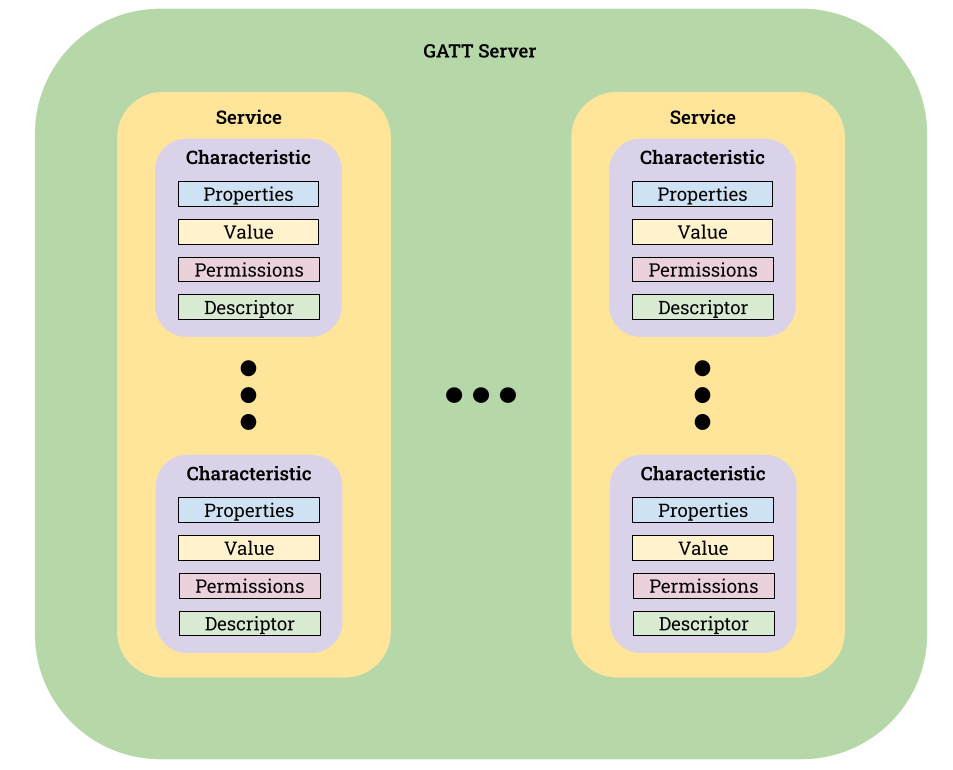
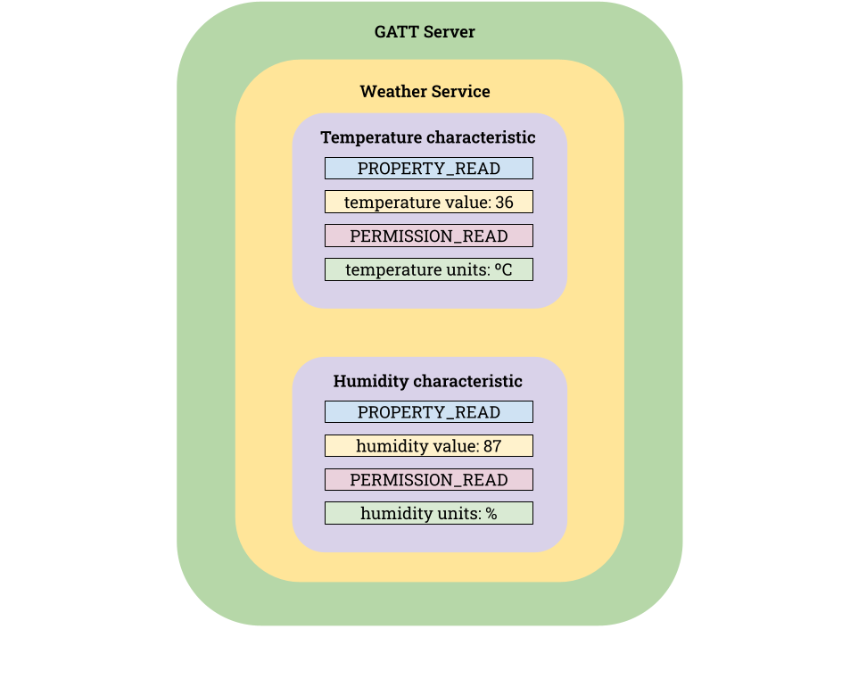

La necesidad de enviar datos mediante el uso de Bluetooth es de sobra conocida por todos nosotros. Tradicionalmente,
protocolos como RFCOMM donde emulamos un puerto serie han sido utilizadas. Con la llegada de BLE (Bluetooth Low Energy)
y las ventajas en cuanto consumo energético que este incorpora, el uso de las comunicaciones Bluetooth tradicionales ha
ido cediendo terreno frente al uso de Bluetooth Low Energy. En Bluetooth Low Energy no tenemos disponible el protocolo
RFCOMM para realizar comunicaciones por lo que para poder realizar las mismas debemos utilizar GATT (Generic ATTribute
Profile).

El perfil GATT de Bluetooth Low Energy define la manera en que los dispositivos BLE se deben comunicar para transferir
datos entre ellos mediante el uso de characteristics y services cuyo funcionamiento detallaremos más adelante. A su vez,
GATT hace uso también del protocolo GAP (Generic Access Profile) que es el encargado de realizar advertisements a partir
de los cuales un dispositivo emisor de BLE, llamado peripheral en GAP, puede ser escaneado y descubierto para
posteriormente conectarnos a él desde otro dispositivo, denominado central. Entre los datos, que el dispositivo que
actúa con el rol de peripheral envía de manera periódica destacan la dirección MAC del dispositivo, su nombre, un
conjunto de flags que definen cómo interactuar con el dispositivo y opcionalmente un listado de UUIDs de los servicios
que incorpora el GATT server en caso de que lo haya. El dispositivo que actúa como central será el encargado de iniciar
la conexión. Después de esto, cuando los dispositivos ya se han conectado a través de BLE es cuando el protocolo GATT
empieza a ser utilizado para realizar comunicaciones asociadas a sus servicios y características.

## Servidor GATT
Como comentábamos anteriormente, un servidor GATT se compone de servicios y características, services y characteristics en inglés.
El esquema general de un servidor GATT se muestra en la siguiente imagen:

Como vemos, un servidor GATT puede estar compuesto por uno o más servicios, que a su vez se componen por una o más características.

Un servicio viene a ser algo así como un conjunto de información que puede estar relacionada entre sí, por ejemplo, un servicio meteorológico. Cada una de las partes de esa información es lo que denominamos característica. Siguiendo con el ejemplo anterior, las características podrían ser la temperatura, la humedad, la fuerza del viento, etc. Cada característica se compone de ciertos campos que definen qué datos exponen y cómo debemos interactuar con los mismos.

Tanto los servicios como las características son descubiertos cuando nos conectamos a un servidor GATT debido a que cada uno es identificable de manera unívoca a través de su UUID. Además, podemos ver su descripción, en caso de que la hubiera, a través del campo descriptor.

El campo properties define como debemos interactuar con los datos que se exponen. Los valores que este campo puede tomar son los siguientes:

| Property | Description |
| --- | --- |
| PROPERTY_READ | La característica soporta lectura |
| PROPERTY_WRITE | La característica soporta escritura |
| PROPERTY_WRITE_NO_RESPONSE | La característica soporta escritura sin esperar respuesta |
| PROPERTY_SIGNED_WRITE | La característica soporta escritura con firma |
| PROPERTY_NOTIFY | La característica soporta suscripción para notificación sin esperar respuesta |
| PROPERTY_INDICATE | La característica soporta suscripción para notificación esperando respuesta |
| PROPERTY_BROADCAST | La característica soporta broadcast |
| PROPERTY_EXTENDED_PROPS | La característica soporta el uso de propiedades extendidas |

Cabe destacar que una misma característica puede hacer uso de varias propiedades al mismo tiempo.

El campo *value*, es el campo que proporciona los datos de la característica y del que vamos a leer, escribir o ser notificados ante sus cambios.

Finalmente, el campo *permissions* nos permite establecer los permisos necesarios para interactuar con la característica según ha sido establecido por el campo *property*.

En la siguiente tabla podemos observar los valores que pueden establecerse para el campo *permissions.*

| Permission | Description |
| --- | --- |
| PERMISSION_READ | Permiso para lectura |
| PERMISSION_READ_ENCRYPTED | Permiso para lectura cifrada |
| PERMISSION_READ_ENCRYPTED_MITM | Permiso para lectura cifrada con protección MITM |
| PERMISSION_WRITE | Permiso para escritura |
| PERMISSION_WRITE_ENCRYPTED | Permiso para escritura cifrada |
| PERMISSION_WRITE_ENCRYPTED_MITM | Permiso para escritura cifrada con protección MITM  |
| PERMISSION_WRITE_SIGNED | Permiso para escritura con firma |
| PERMISSION_WRITE_SIGNED_MITM | Permiso para escritura con firma con protección MITM  |

## Ejemplo de servidor GATT para una estación meteorológica

Imaginemos que queremos crear nuestro servidor GATT para una estación meteorológica. 
Nuestra estación meteorológica es capaz de medir la temperatura y la humedad por lo que para poder hacer uso de un servidor 
GATT podríamos tener un servicio que llamaremos *weather_service* y dos características *temperature_characteristic* y *humidity_characteristic.* 
Ambas características tendrán soportan lectura y a su vez tienen permisos de lectura para cualquier dispositivo en el rango de BLE.

En la siguiente imagen podemos observar un esquema del servidor GATT de nuestra estación meteorológica.

