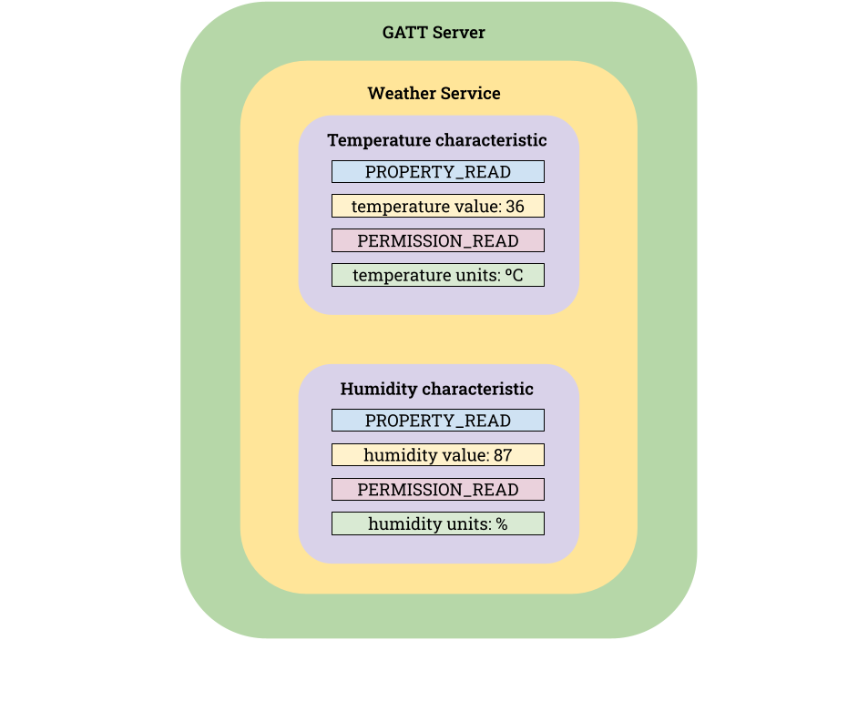
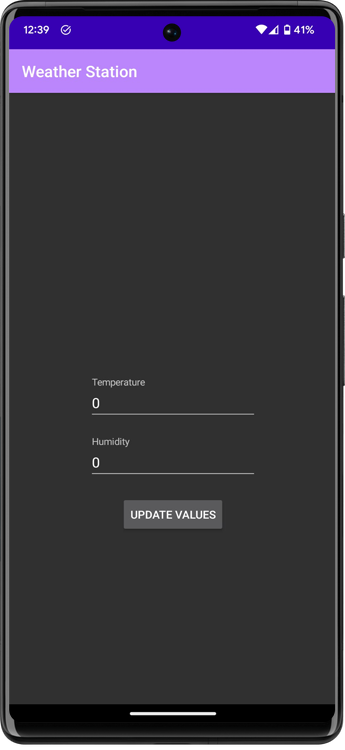

En este artículo iremos directamente a la implementación de un *GATT server* para una estación meteorológica. Como recordatorio de cómo vamos a estructurar nuestra estación meteorológica podemos observar la siguiente imagen.



Si quieres saber más acerca del funcionamiento general de BLE y GATT puedes visitar el artículo anterior donde abarcamos en detalle y de forma teórica el mismo: [https://ivansantosgonzalez.dev/bluetooth-gatt-server](https://ivansantosgonzalez.dev/bluetooth-gatt-server).

Este artículo se divide en dos grandes bloques, un primer bloque para detallar la implementación de los *advertisements* y otro donde detallaremos la configuración del *GATT Server* y el servicio y características asociados.
Cabe destacar también que para el correcto funcionamiento de la aplicación de ejemplo desarrollada es necesario conceder permisos de Bluetooth a la misma. Para ello, se ha utilizado la librería PermissionX en la aplicación de ejemplo ya que el manejo de permisos no es el objetivo de este artículo.

## Advertisement

Para realizar el *advertisement* de paquetes a través de Bluetooth Low Energy hemos creado 4 funciones, `createAdvertisementParameters`, `createAdvertisementData` , `createAdvertisementCallback` y `startAdvertising` que se encargan de configurar los diferentes parámetros necesarios para iniciar el *advertisement* de paquetes.

A continuación podemos observar la función `createAdvertisementParameters` que se encarga de configurar los diferentes parámetros relativos a cómo vamos a utilizar Bluetooth Low Energy para comunicarnos.

```kotlin
private fun createAdvertisementParameters(): AdvertisingSetParameters {
	return AdvertisingSetParameters.Builder()
            .setLegacyMode(true)
            .setScannable(true)
            .setConnectable(true)
            .setInterval(AdvertisingSetParameters.INTERVAL_MIN)
            .setTxPowerLevel(AdvertisingSetParameters.TX_POWER_MEDIUM)
            .build()
}
```

Hay más parámetros que podemos configurar pero los más importantes son los que observamos en el bloque código anterior.

Dentro de los *advertisements* podemos incluir un total de 32 bytes de datos para el modo *legacy* y 255 si el modo utilizado es el extendido. Entre los datos que podemos incluir en los paquetes de *advertisement* destacan el nombre del dispositivo, un UUID de servicio en caso de tener configurado un servidor GATT y datos extra en el campo *service data*.

En el siguiente bloque de código podemos observar la función  `createAdvertisementData` que se encarga de configurar estos parámetros.

```kotlin
private funcreateAdvertisementData(): AdvertiseData {
	return AdvertiseData.Builder()
            .setIncludeDeviceName(true)
            .addServiceUuid(ParcelUuid.fromString(WEATHER_SERVICE_UUID))
	    .addServiceData(ParcelUuid.fromString(WEATHER_SERVICE_UUID), "some data".toByteArray())
            .build()
}
```

Algo que debemos tener en cuenta cuando definimos estos parámetros es no sobrepasar el tamaño total del paquete de datos entre todos los campos ya que de lo contrario no podremos realizar el advertisement.

Finalmente, podemos definir diferentes funciones de *callback* con las que reaccionaremos a los diferentes aspectos relacionados con los *advertisements*. Entre dichos eventos destacan el inicio del *advertisement*, el establecimiento de los datos del *advertisement*, el fin del *advertisement* y la respuesta al escaneo entre otros.

En el siguiente bloque de código podemos observar la función `createAdvertisementCallback` y un ejemplo de creación de estos *callbacks.*

```kotlin
private funcreateAdvertisementCallback(): AdvertisingSetCallback {
    return object: AdvertisingSetCallback() {
        override funonAdvertisingSetStarted(
            advertisingSet: AdvertisingSet,
            txPower: Int,
            status: Int
        ) {
            Log.i(LOG_TAG, "onAdvertisingSetStarted(): txPower:$txPower , status: $status")
        }

        override funonAdvertisingDataSet(advertisingSet: AdvertisingSet, status: Int) {
            Log.i(LOG_TAG, "onAdvertisingDataSet() :status:$status")
        }

        override funonScanResponseDataSet(advertisingSet: AdvertisingSet, status: Int) {
            Log.i(LOG_TAG, "onScanResponseDataSet(): status:$status")
        }

        override funonAdvertisingSetStopped(advertisingSet: AdvertisingSet) {
            Log.i(LOG_TAG, "onAdvertisingSetStopped():")
        }
    }
}
```

Finalmente podemos ver la función `startAdvertising` que usa las funciones anteriores y comienza el *advertisement* de paquetes.

```kotlin
funstartAdvertising() {
    setupGattServer(context)
    val advertisementParameters = createAdvertisementParameters()
    val advertisementData = createAdvertisementData()
    bluetoothLeAdvertiser.startAdvertisingSet(advertisementParameters, advertisementData, null,	null, null, 0, 0, advertisementCallback)
    isAdvertising = true
    Log.i(LOG_TAG, "startAdvertising()")
}
```

## GATT Server

Para crear nuestro servicio meteorológico necesitamos crear 1 *service* que contenga 2 *characteristics*, una para la temperatura y otra para la humedad. En nuestro código esto se realiza en la función `createGattService` que podemos ver a continuación.

```kotlin
private fun createGattService(): BluetoothGattService {
    val service = BluetoothGattService(
        ParcelUuid.fromString(WEATHER_SERVICE_UUID).uuid,
        BluetoothGattService.SERVICE_TYPE_PRIMARY
    )

    val temperatureCharacteristic = BluetoothGattCharacteristic(
        ParcelUuid.fromString(TEMPERATURE_CHARACTERISTIC_UUID).uuid,
        BluetoothGattCharacteristic.PROPERTY_READ,
        BluetoothGattCharacteristic.PERMISSION_READ	
    )
    service.addCharacteristic(temperatureCharacteristic)

    val humidityCharacteristic = BluetoothGattCharacteristic(
        ParcelUuid.fromString(HUMIDITY_CHARACTERISTIC_UUID).uuid,
        BluetoothGattCharacteristic.PROPERTY_READ,
        BluetoothGattCharacteristic.PERMISSION_READ
    )
    service.addCharacteristic(humidityCharacteristic)

    returns ervice
}
```

En esta función creamos nuestro servicio y características configurando sus UUID identificativos y las propiedades y permisos necesarios como definimos en el artículo anterior y podemos ver en el [diagrama inicial](https://www.notion.so/Implementaci-n-de-GATT-Server-en-Android-230ae2f3e4784bbf85c65137912ec352?pvs=21) del artículo actual.

Además de lo anterior debemos definir los *callbacks* necesarios para interactuar con los dispositivos que traten de leer nuestras *characteristics.* Esto es realizado sobrecargando la clase `BluetoothGattServerCallback` e implementando nuestros propios procesos para responder a los diferentes eventos. En el caso de nuestro ejemplo solo responderemos a los eventos de lectura, por lo tanto, solo implementaremos el callback `onCharacteristicReadRequest` como podemos observar en nuestra implementación que se muestra a continuación.

```kotlin
inner classGattServerCallback : BluetoothGattServerCallback() {
    override funonCharacteristicReadRequest(
        device: BluetoothDevice?,
        requestId: Int,
        offset: Int,
        characteristic: BluetoothGattCharacteristic?
    ) {
	super.onCharacteristicReadRequest(device, requestId, offset, characteristic)
	if(characteristic!!.uuid.toString() == TEMPERATURE_CHARACTERISTIC_UUID) {
            Log.d(LOG_TAG, "Reading temperature characteristic")
            gattServer.sendResponse(
                device,
                requestId,
                BluetoothGatt.GATT_SUCCESS,
                offset,
                temperatureValue.toByteArray()
            )
        }
	else if(characteristic.uuid.toString() == HUMIDITY_CHARACTERISTIC_UUID) {
            Log.d(LOG_TAG, "Reading humidity characteristic")
            gattServer.sendResponse(
                device,
                requestId,
                BluetoothGatt.GATT_SUCCESS,
                offset,
                humidityValue.toByteArray()
            )
        }
    }
}
```

Finalmente, utilizaremos la función `setupGattServer` para asignar todos los parámetros configurados mediante las funciones anteriores para incluirlo en nuestro servidor GATT. La función `setupGattServer` es invocada en la función `startAdvertising` para que todo el sistema funcione de manera conjunta.

```kotlin
private funsetupGattServer(context: Context) {
    gattServerCallback = GattServerCallback()
    gattServer = bluetoothManager.openGattServer(context, gattServerCallback)
    val service = createGattService()
    val serviceExists = gattServer.getService(service.uuid) != null
    if(!serviceExists) {
        gattServer.addService(service)
    }
}
```

## Conclusiones

Este artículo puede servir como continuación al anterior [https://ivansantosgonzalez.dev/bluetooth-gatt-server](https://ivansantosgonzalez.dev/bluetooth-gatt-server) y trata de implementar un servicio meteorológico donde poner en práctica en una aplicación Android los diferentes conceptos relacionados con Bluetooth Low Energy y GATT vistos en el artículo anterior.

Finalmente podemos observar una captura de la aplicación de prueba desarrollada, cuyo código está disponible en el siguiente repositorio de Github, [https://github.com/IvanSantosGonz/BLEWeatherStation](https://github.com/IvanSantosGonz/BLEWeatherStation).

