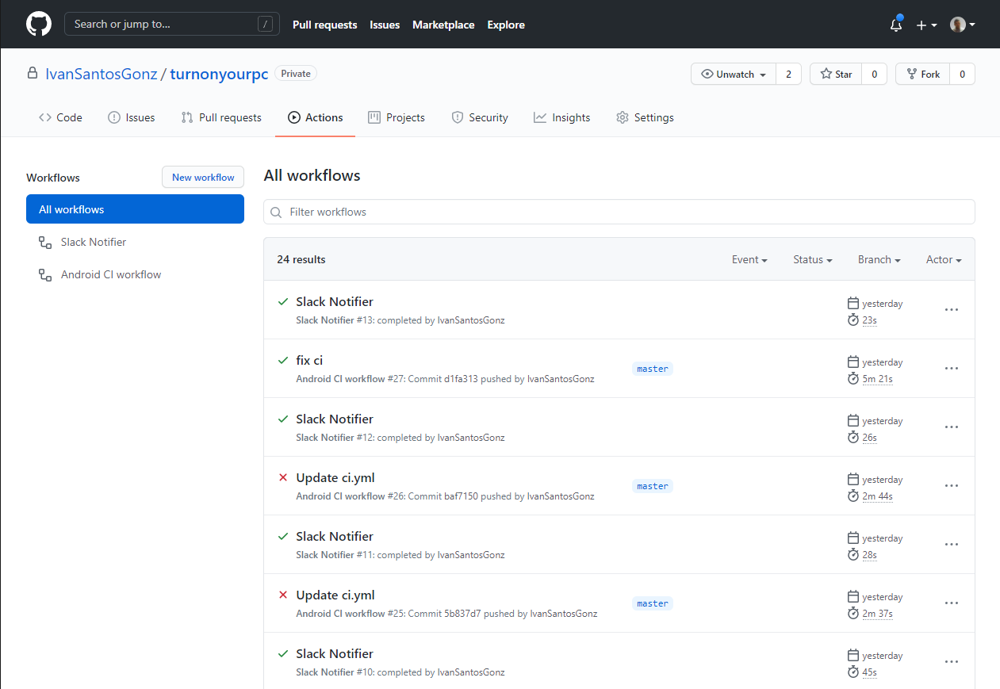

# Integración Continúa en Proyectos Android Nativo con Github Actions

La integración continua en los diferentes proyectos que abordamos en el día a día es cada vez mas importante, más si
cabe, teniendo en cuenta que en la mayoría de los casos trabajamos en equipo. Debido a esto, tener un sistema que nos
permita construir nuestro software y pasar los test de manera automática frente a cada cambio puede ser de vital
importancia.

## ¿Qué es una integración continúa? 🚀

En el párrafo anterior ya podemos atisbar la respuesta a esta pregunta que nos hacemos. Una definición de integración
continua, que en particular a mi me gusta mucho, es la que nos daba Martin Fowler: "*Continuous Integration is a
software development practice where members of a team integrate their work frequently, usually each person integrates at
least daily - leading to multiple integrations per day. Each integration is verified by an automated build (including
test) to detect integration errors as quickly as possible.*", que en español viene a decir algo así como que la
integración continua es una práctica donde los miembros de un equipo validan la integración de sus aportaciones
individuales mediante la construcción automática, incluida la ejecución de los tests, de manera que podamos detectar
problemas de integración lo más pronto posible. Es obvio, que disponer de un sistema de integración continua en nuestros
proyectos puede aportarnos grandes ventajas destacando entre ellas la detección temprana de errores así como el evitar
realizar integraciones de gran tamaño consiguiendo a su vez disponer de una versión actualizada de nuestro sistema.

Para que la integración continua funcione de manera adecuada, los desarrolladores debemos integrar nuestros cambios
idealmente varias veces al día para, mediante pequeños pasos, ir acercándonos al objetivo final pudiendo tener una mayor
flexibilidad ante posibles cambios.

## ¿Qué es Github Actions? ☁

Github Actions es un sistema que tiene como principal objetivo automatizar tareas relacionados con el ciclo de vida del
desarrollo de un software. Tiene como principal virtud la capacidad de automatizar, personalizar y ejecutar pipelines de
tareas (denominados workflows) directamente en tu repositorio de Github. La ejecución de estas tareas se realizan
después de que un evento concreto haya ocurrido. Los eventos disparadores del workflow son eventos relacionados con el
repositorio, como pueden ser una pull-request, push, merge, etc.
La [lista completa de eventos](https://docs.github.com/es/free-pro-team@latest/actions/reference/events-that-trigger-workflows)
puede ser observada en la documentación de Github Actions. Además, permite combinar diferentes acciones dentro de un
mismo workflow para la ejecución de las diferentes tareas, así como ofrece también la posibilidad de tener varios
workflows en un mismo repositorio. Finalmente, cabe destacar que dispone de
un [marketplace de acciones](https://github.com/marketplace?type=actions) creadas por otros desarrolladores.

## Pasos necesarios para ejecutar los test en Android 🧪

Para compilar un proyecto Android y generar el APK de la aplicación, es necesario tener instalado el SDK de Android
correspondiente a la version definida en el propio proyecto Android que estamos desarrollando. Para realizar esto en el
sistema de integración continua utilizando Github Actions, una opción podría ser el crear una imagen de docker que
contenga todo lo necesario para realizar este proceso. En el caso que nos atañe, las imágenes de Ubuntu disponibles en
Github Actions ya tienen gran cantidad de software preinstalado, entre el que se encuentra el SDK de Android en todas su
versiones, por lo que no necesitaríamos crear una imagen con docker. La lista completa de software instalado en la
última versión de Ubuntu disponible en Github Actions puede
verse [aquí](https://github.com/actions/virtual-environments/blob/main/images/linux/Ubuntu2004-README.md).

Una vez hecha la build del proyecto simplemente necesitaríamos ejecutar los test utilizando
gradle, `gradlew testDebugUnitTest`.

## Ejemplo de workflow de CI 🤯

Para crear nuestro workflow de Github Actions basta con crear un directorio `workflows` dentro`.Github`  de nuestro
proyecto y crear ahí nuestro fichero con extensión `.yml`, en nuestro caso `ci.yml`. Cuando hagamos `push` de este
fichero, Github detectará todo lo que esté dentro de la carpeta `workflows` como `workflows` de Github Actions.

A continuación, podemos observar un ejemplo de workflow de integración continua de un proyecto Android real.

```yaml
name: Android CI workflow

on: [ push ]

jobs: # jobs a ejecutar
  build: # nombre del job a ejecutar
    runs-on: ubuntu-latest # sistema operativo donde ejecutaremos el job

    steps: # pasos del workflow
      - uses: actions/checkout@v2 # checkout del proyecto

      - name: Decode google-services.json # tarea para decodificar los google services
        env:
          GOOGLE_SERVICE_SECRET: ${{ secrets.GOOGLE_SERVICE }} # almacenamos secret en   variable de entorno
        run: echo $GOOGLE_SERVICE_SECRET > ./app/google-services.json # creamos el fichero google-services.json en la ruta correspondiente

      - name: Make gradlew executable # damos permisos de ejecución al fichero gradlew
        run: chmod +x ./gradlew

      - name: Build Android project # compilamos el proyecto
        run: ./gradlew assembleDebug

      - name: Launch unit tests # lanzamos los tests
        run: ./gradlew testDebugUnitTest

      - name: Android Test Report # visualizamos el resultado de los tests
        uses: asadmansr/android-test-report-action@v1.2.0
```

Destacar que este workflow se ejecutará cada vez que se haga push a la rama master del repositorio del proyecto, como
puede verse en la clave `on` en el snippet de código anterior.

Por otro lado, este proyecto hace uso de diferentes servicios de Google como Firebase, y por tanto las claves necesarias
para comunicarnos con dichos servicios son necesarias para compilar el proyecto y generar el ejecutable. No es una buena
práctica subir dichas claves a los repositorios ya que cualquier persona que tenga acceso al mismo podría acceder a
ellas. Github provee un servicio llamado secrets el cual nos permite almacenar claves y otro tipo de contenido sensible
de manera segura. En nuestro caso guardamos el contenido del fichero google-services.json en Github secrets y
posteriormente en la tarea `Decode google-services.json` lo almacenamos en una variable de entorno para posteriormente
almacenarla en su fichero correspondiente para usarlo en la compilación del proyecto pero sin persistirlo luego en
nuestro repositorio.

El siguiente paso consiste en dar permisos de ejecución al fichero `gradlew` para compilar el proyecto y luego lanzar
los tests del mismo.

Finalmente, debido a que gradlew genera un fichero de reporte con el resultado de los tests, debemos visualizar el
contenido de los mismos parseando el fichero de reporte generado. En este paso, haciendo uso del marketplace encontramos
la acción `android-test-report-action` que se encarga de parsear y mostrarnos el resultado del reporte y que es la
utilizada en el último paso del workflow.

Finalmente, una vez hemos hecho push de nuestro fichero podemos ver las diferentes ejecuciones de nuestro workflow en la
sección Actions de en nuestro repositorio de Github como podemos observar en la imagen que se muestra a continuación.



## Extra: notificación de fallo del workflow vía Slack ✉

Un aspecto importante en un sistema de integración continua la capacidad de conocer el estado del mismo en todo momento.
El hecho de disponer de un sistema capaz de notificar frente a un fallo en la integración continua es una feature de
bastante importancia en este tipo de sistemas. Para este cometido, en el proyecto anteriormente comentado se ha
implementado un nuevo workflow capaz de escuchar cuando el workflow de integración continua falla y enviar una
notificación a un canal de slack en concreto.

```yaml
name: Slack Notifier

on:
  workflow_run: # trigger utilizado
    workflows: [ "Android CI workflow" ] # nombre del workflow a escuchar
    branches: [ master ]
    types:
      - completed # escuchar cuando el workflow ha terminado de ejecutarse

jobs: # jobs a ejecutar
  slackNotification: # nombre del job a ejecutar
    runs-on: ubuntu-latest # sistema operativo donde ejecutaremos el job

    steps: # pasos del workflow
      - name: Slack Notification # notificación al canal general 
        uses: rtCamp/action-slack-notify@v2
        env: #variables de entorno relacionadas con el mensaje de slack a enviar
          SLACK_CHANNEL: general
          SLACK_COLOR: '#3278BD'
          SLACK_USERNAME: "WoL Assistant Bot"
          SLACK_MESSAGE: "Continuous Integration Broken"
          SLACK_WEBHOOK: ${{ secrets.SLACK_WEBHOOK }} # webhook del canal del slack al que enviar
        if: env.WORKFLOW_CONCLUSION == 'failure' # condición para enviar mensaje solo en casos de que el workflow de CI falle
```

En este workflow se ha utilizado la Github Action `action-slack-notify` que nos permite enviar un mensaje a un canal de
slack a través del uso de diferentes parámetros. Destacar de nuevo, el uso de Github secrets para almacenar el valor del
webhook ya que es nuevamente información sensible.

## Referencias

[Documentación oficial de Github Actions](https://docs.github.com/es/free-pro-team@latest/actions)

[Marketplace de Github Actions](https://github.com/marketplace?type=actions)

[Post sobre integración continua de Martin Fowler](https://www.martinfowler.com/articles/continuousIntegration.html)