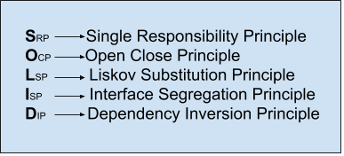
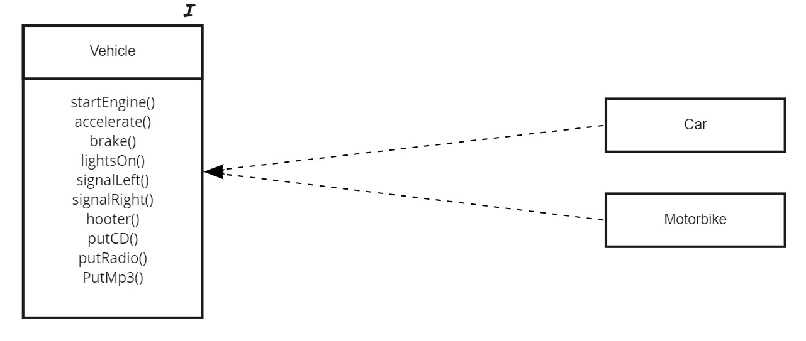
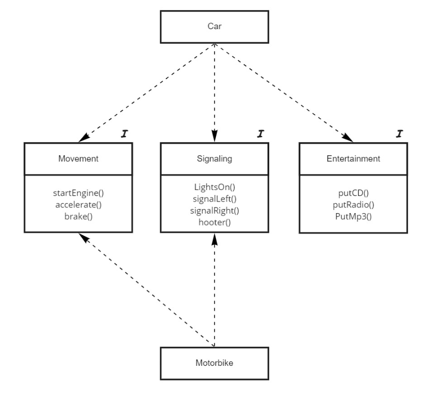

# Refrescando Principios SOLID

## Introducción

Los principios SOLID consisten en una serie de recomendaciones o directrices establecidas por *Robert C. Martin* y ampliamente extendidas que tienen como fin ayudarnos a desarrollar software de mayor calidad mediante una mayor legibilidad y mantenibilidad de nuestro código. Los principios SOLID consisten en 5 directrices o recomendaciones cuyos nombres comienzan por cada una de las letras de la palabra SOLID. Estos principios son los siguientes: 


## Single Responsibility Principle

El principio de responsabilidad única se basa principalmente en que una clase de nuestro proyecto debe estar diseñada para realizar un único cometido. De esta manera conseguimos tener un código más ordenado y robusto ya que evitamos tener código duplicado. Este principio puede ser llevado tan profundamente en nuestro código y se aplicado también a funciones de manera que una función debe realizar un único cometido. 

- Ejemplo de violación de SRP

```csharp
public class Person {
   private string name;
   private int bornDay;
   private int bornMonth;
   private int bornYear;

   public Person(string name, int bornDay, int bornMonth, int bornYear) {
      this.name = name;
      this.bornDay = bornDay;
      this.bornMonth = bornMonth;
      this.bornYear = bornYear;
   }

   public void printAge() {
      if (nowMonth >= bornMonth && nowDay >= bornDay) {
         Console.WriteLine("Person has " + nowYear - bornYear);
      }      
      else {
         Console.WriteLine("Person has " + nowYear - bornYear - 1);
      }
   }
}

class Init {
   private Init() {
      var person = new Person("Iván", 1, 1, 1990);
      person.PrintAge();
   }
}
```

- Refactor cumpliendo SRP

```csharp
public class Person {
   private string name;
   private int bornDay;
   private int bornMonth;
   private int bornYear;

   public Person(string name, int bornDay, int bornMonth, int bornYear) {
      this.name = name;
      this.bornDay = bornDay;
      this.bornMonth = bornMonth;
      this.bornYear = bornYear;
   }

   public int getAge() {
      if (nowMonth >= bornMonth && nowDay >= bornDay) {
         return(nowYear - bornYear);
      }
      else {
         return (nowYear - bornYear - 1);
      }
   }
}

class Init {
   private Init() {
      var person = new Person("Iván", 1, 1, 1990);
      Console.WriteLine("Person has " + person.getAge());
   }
}
```

## Open Close Principle

El principio de Abierto/Cerrado consiste en mantener nuestro software abierto a ser extendido pero cerrado a modificación. De esta manera, si queremos añadir nuevas funcionalidades a nuestro software debemos extender su comportamiento sin modificar el código fuente. Para ello hay básicamente dos técnicas para llevarlo a cabo, utilizar clases abstractas y utilizar interfaces.

- Ejemplo de violación de OCP

```csharp
public class Person {
   private string name;
   private int bornDay;
   private int bornMonth;
   private int bornYear;

   public Person(string name, int bornDay, int bornMonth, int bornYear) {
      this.name = name;
      this.bornDay = bornDay;
      this.bornMonth = bornMonth;
      this.bornYear = bornYear;
   }

   public int getAge() {
      if (nowMonth >= bornMonth && nowDay >= bornDay) {
         return(nowYear - bornYear);
      }
      else {
         return (nowYear - bornYear - 1);
      }
   }
}

public class Dog {
   private string name;
   private int bornDay;
   private int bornMonth;
   private int bornYear;

   public Dog(string name, int bornDay, int bornMonth, int bornYear) {
      this.name = name;
      this.bornDay = bornDay;
      this.bornMonth = bornMonth;
      this.bornYear = bornYear;
   }
        
   public int getAge() {
      if (nowMonth >= bornMonth && nowDay >= bornDay) {
         return((nowYear - bornYear) * 7);
      }
      return ((nowYear - bornYear - 1) * 7);
   }
```

- Refactor a través de clase abstracta

```csharp
public abstract class LivingCreature {
   private string name;
   private int bornDay;
   private int bornMonth;
   private int bornYear;

   public LivingCreature(string name, int bornDay, int bornMonth, int bornYear) {
      this.name = name;
      this.bornDay = bornDay;
      this.bornMonth = bornMonth;
      this.bornYear = bornYear;
   }

   public virtual int getAge() {
      if (nowMonth >= bornMonth && nowDay >= bornDay) {
         return (nowYear - bornYear);
      }
      return (nowYear - bornYear - 1);
   }
}

public class Person : LivingCreature {
   public Person(string name, int bornDay, int bornMonth, int bornYear) :
      base(name, bornDay, bornMonth, bornYear) {
   }
}

public class Dog : LivingCreature {
   public Dog(string name, int bornDay, int bornMonth, int bornYear) :
      base(name, bornDay, bornMonth, bornYear) {
   }

   public int getAge() {
      return base.getAge() * 7;
   }
}
```

- Refactor utilizando interfaz

```csharp
public interface LivingCreatureDefaultAge {
   public int getAge(int bornDay, int bornMonth, int bornYear) {
      if (05 >= bornMonth && 03 >= bornDay) {
         return (2020 - bornYear);
      }
      return (2020 - bornYear - 1);
   }
}

public class Person : LivingCreatureDefaultAge {
   private string name;
   private int bornDay;
   private int bornMonth;
   private int bornYear;

   public Person(string name, int bornDay, int bornMonth, int bornYear) {
      this.name = name;      
      this.bornDay = bornDay;
      this.bornMonth = bornMonth;
      this.bornYear = bornYear;
   }

   public int getAge() {
      LivingCreatureDefaultAge livingCreatureDefaultAge = this;
      return livingCreatureDefaultAge.getAge(bornDay, bornMonth, bornYear);
   }
}

public class Dog : LivingCreatureDefaultAge {
   private string name;
   private int bornDay;
   private int bornMonth;
   private int bornYear;

   public Dog(string name, int bornDay, int bornMonth, int bornYear) {
      this.name = name;
      this.bornDay = bornDay;
      this.bornMonth = bornMonth;
      this.bornYear = bornYear;
   }

   public int getAge() {
      LivingCreatureDefaultAge livingCreatureDefaultAge = this;
      return livingCreatureDefaultAge.getAge(bornDay, bornMonth, bornYear) * 7;
   }
}
```

## Liskov Substitution Principle

El principio de sustitución de Liskov consiste en la capacidad de poder sustituir una clase padre por una clase hija en el caso de jerarquías o herencias sin que se altere el comportamiento de la aplicación desarrollada. En el caso del ejemplo anterior podemos observar como cualquier instancia de la clase LivingCreature puede ser sustituida por la clase Person.  El uso de este principio nos ayuda a su vez a poder cumplir OCP. Para poder llevar a cabo este principio comportamiento de de las subclases debe respetar el contrato establecido en la superclase.

- Ejemplo de LSP

```csharp
public abstract class LivingCreature {
   protected string name;
   private int bornDay;
   private int bornMonth;
   private int bornYear;

   public LivingCreature(string name, int bornDay, int bornMonth, int bornYear) {
      this.name = name;
      this.bornDay = bornDay;
      this.bornMonth = bornMonth;
      this.bornYear = bornYear;
   }

   public virtual int getAge() {
      if (nowMonth >= bornMonth && nowDay >= bornDay) {
         return (nowYear - bornYear);
      }
      return (nowYear - bornYear - 1);
   }
}

public class Person : LivingCreature {
    private string surname;

    public Person(string name, string surname, int bornDay, int bornMonth, int bornYear) :
        base(name, bornDay, bornMonth, bornYear) {
        this.surname = surname;
    }

    public string getNameAndSurname() {
        return base.name + ' ' + this.surname;
    }
}

class Init {
   private Init() {
      var person = new Person("Iván", "Santos", 12, 1, 1990);
      Console.WriteLine("Person has " + person.getAge());

			var livingCreature = new LivingCreature("Iván", 12, 1, 1990);
      Console.WriteLine("livingCreature has " + livingCreature.getAge());
   }
}
 
```

## Interface Segregation Principle

El principio de segregación de interfaces o ISP se basa en la necesidad de que todos los clientes que implementen las mismas deben necesitar todos los métodos de ella, de manera que si esto no ocurre implica que estamos violando este principio y debemos crear interfaces más pequeñas. En este sentido, ningún cliente debe depender de métodos que no usa. Es importante recordar en este sentido que las interfaces pertenecen a los clientes no a quien las implementan. Un ejemplo claro de esto es la típica interfaz repositorio, que pertenecería a nuestro cliente y no a las diferentes implementaciones (SQLRepository, MongoDBRepository, ...) de las mismas.  

- Ejemplo de violación de ISP

    En este caso, tenemos nuestra interfaz vehículo que tiene que ser implementada tanto por coche como por moto. En este caso todas las funcionalidades de vehículo son utilizadas por coche pero en el caso de moto estaríamos violando ISP porque dependemos de putCD(), putRadio() y putMp3() que son métodos innecesarios para moto. Por otro lado tendríamos acoplamiento estructural entre vehículo y coche ya que los métodos concuerdan en relación 1 a 1 entre ambos. 



- Aplicando SRP

    En este caso se ha dividido la interfaz vehículo en 3 nuevas interfaces, Movement, Signaling y Entertainment, de manera que tanto coche como moto no dependerían de métodos que no utilizan.


